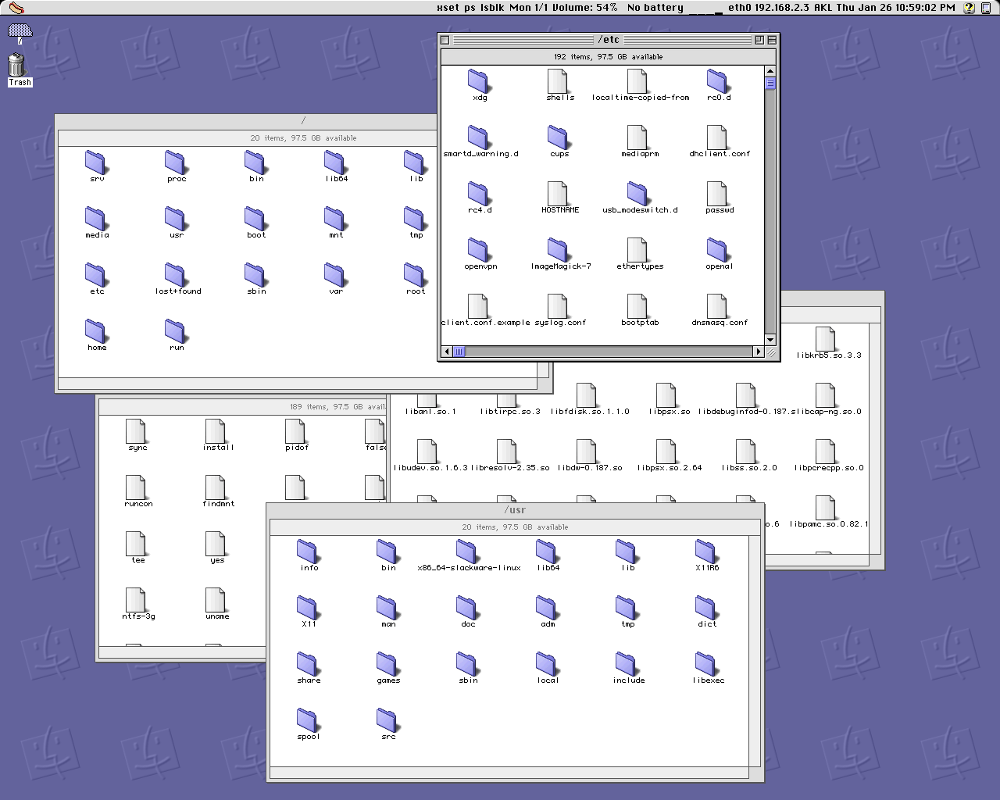
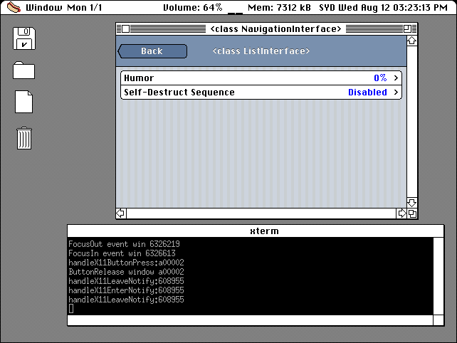
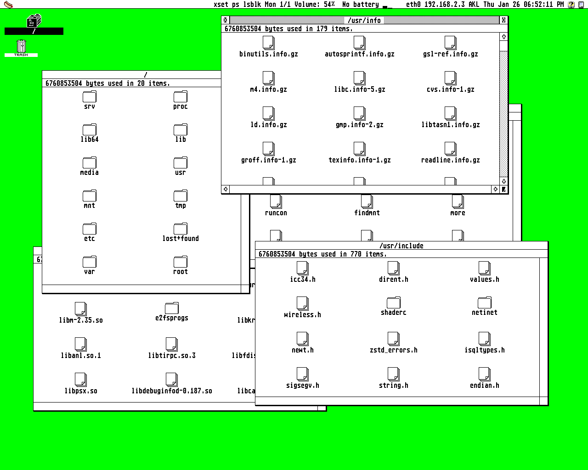
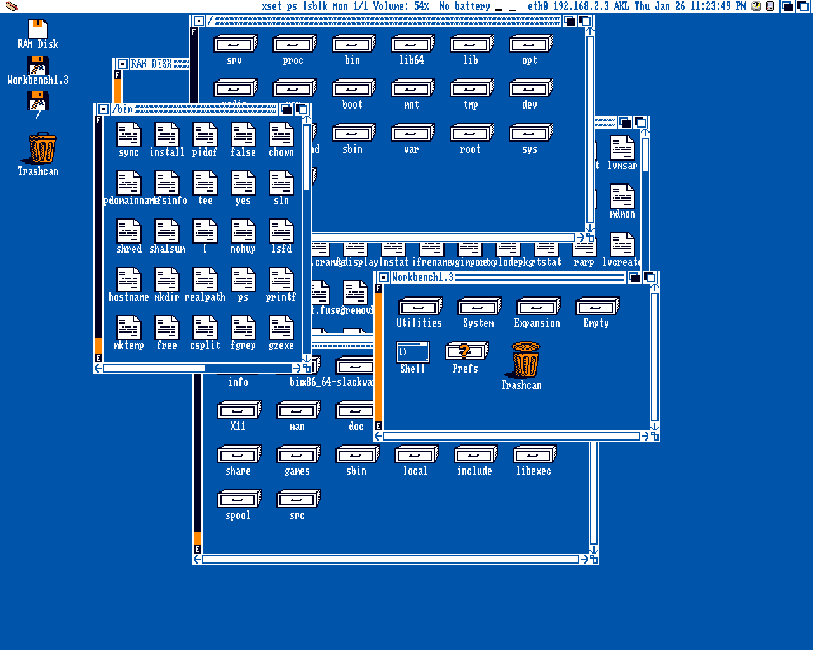
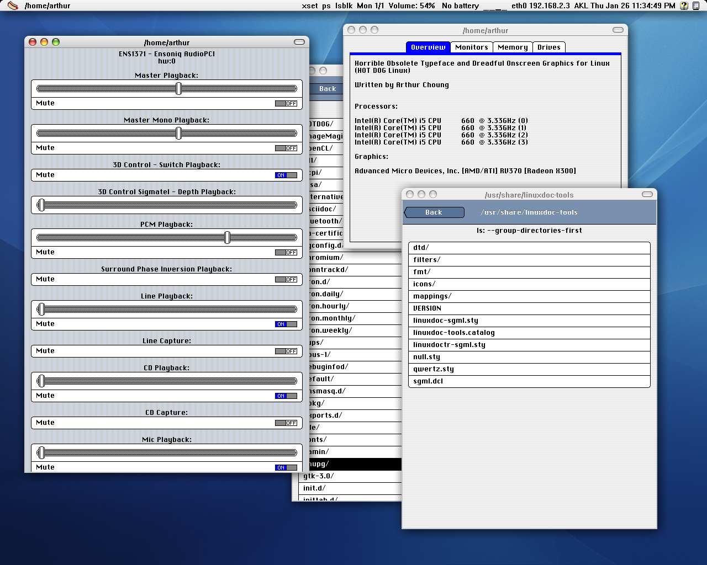
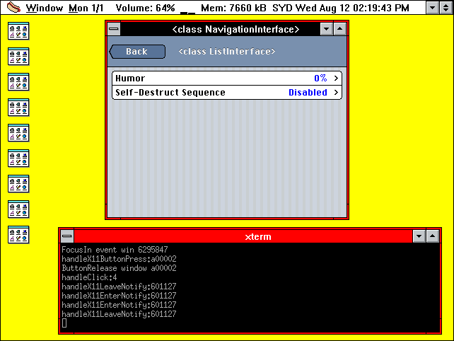

# HOT DOG Linux

For more information, please visit http://hotdoglinux.com

## Download

Installer ISO based on Slackware64 (1.28 GB)

Minimal ISO based on Slackware64 that runs from RAM (192 MB)

Boot with Legacy BIOS.

If using VirtualBox, 3D acceleration should be enabled.

This is a multilib system, the only 32-bit application included is Wine.

It comes with the 64-bit gcc only, so the included gcc cannot create 32 bit binaries.

It is a stripped down system that does not include systemd, wayland, elogind, polkit, pulseaudio, or NetworkManager.

http://hotdoglinux.com/download/

## Hot Dog (Linux) on a (USB) stick

To write the image to a USB drive:

$ dd if=/path/to/file.iso of=/dev/sdX bs=1M

/path/to/file.iso is the file name of the image file.

/dev/sdX is the USB device to write the image to.

Run as root. Be careful not to write to the wrong drive.

## Overview

The design goals of HOT DOG Linux include:

  * Graphical user interface based on retro computer systems including Hot Dog Stand (Windows 3.1), Amiga Workbench, Atari ST GEM, Mac Classic and Aqua
  * Custom lightweight Objective-C foundation
  * Bitmapped graphics, low DPI displays
  * No Unicode support by design

HOT DOG Linux uses a custom lightweight Objective-C foundation on top of the GCC Objective-C runtime. The style of Objective-C is completely different from the one Apple uses, everything is basically **id**.

Alternatively, it is possible to use an older version of the GNUstep Objective-C runtime that uses the old object struct layout (located in external/libobjc2). This requires everything to be compiled with clang, and allows for the use of Objective-C 2.0 features such as NSFastEnumeration and NSArray/NSDictionary literals, as well as blocks and libdispatch (with the appropriate libs). However, the GCC runtime has better performance, so it is the default.

By design, Unicode is not supported.

Low DPI displays are preferred, since the graphics are bitmapped and fixed in size.

HOT DOG Linux does not use Automatic Reference Counting. It causes problems with type-checking during compilation (it is too strict).

HOT DOG Linux is an acronym that stands for **H**orrible **O**bsolete **T**ypeface and **D**readful **O**nscreen **G**raphics for Linux.

## How to compile and run

$ sh makeUtils.sh

$ perl build.pl

To run the window manager:

$ ./hotdog runWindowManager

To run the iPod style interface:

$ ./hotdog

## Notes

Aqua mode uses 'compton' for window drop shadows and 'feh' to set the wallpaper.

Some of the Perl scripts use the JSON module.

## Screenshots

Mac Platinum 1280x1024

Mac Color 1280x1024

Mac Classic 1280x1024

Atari ST GEM 1280x1024

Amiga Screenshot 1280x1024

Aqua 1280x1024

Hot Dog Stand 1280x1024

## HOTDOGbuntu -- Ubuntu compatibility

HOTDOG can be run on Ubuntu and its derivatives.

See the NOTES-Ubuntu file for more information.

## What I have learned from this project...

The goal is to have a graphical Unix style workstation, something both Mac OS X and Linux seem to have moved away from. It is not important to have a simplified interface that is easy to use for the average person. It is not important to convert users from another OS.

The first graphical Unix workstations seem to have been machines like the Sun-2 built with a 68010 and a custom MMU, and Apollo's crazy dual-68000 computer. The 68020 seems to have been one of the first viable CPU's for running Unix when paired with a 68851 MMU, with the 68030 being a better all-in-one design. The first versions of NeXTStep ran on a 68030.

In the same time period, the 386 became available and was also an excellent CPU for running Unix. The first versions of Linux were written for this CPU. Although it was possible to run a Unix-like OS on a 286 (such as QNX, Minix and Xenix) and a multitasking and memory-protected OS like OS/2, the 16-bit segmented design of the 286 makes it awkward, compared to using a fully 32-bit processor.

It was even possible to run a Unix-like OS on the 8-bit 6809 (OS/9), so being able to run Unix is more a function of having features like an MMU and relocatable code, as opposed to raw processing power.

So the focus is on having a GUI that does not waste too many CPU cycles or use too much RAM. The first GUI's for personal computers were mostly in the 16-bit era (such as Mac System 6, Amiga Workbench, Atari ST GEM, Windows 3.1). These are capable of running on a 68000 or 286 with a minimal amount of RAM.

Windows 95 officially requires a 386DX, which is a 32-bit CPU. The colorized version of Mac System 7 requires a 68020, which is a 32-bit CPU. Both will be considered to be bloated.

So the focus will be on the computers which were still part of the 8-bit and 16-bit era. Although the 68000/68010 has a 32-bit instruction set, it has a 16-bit data bus and a 24-bit address bus, so the 68000/68010 will be included, but the 68020 has a 32-bit data bus, so it will not be included. The 68EC020 has a 24-bit address bus, so it will not be included either. The 386SX has a 16-bit data bus, so it will be included, even though it is otherwise a 32-bit processor. It is possible for a 286 to run faster than a 386SX. The 386DX was fully 32-bit, so it will not be included. This means a computer like the FM Towns Marty will be considered to be part of the 16-bit era since it has a 386SX. 

The graphical elements from the 16-bit computers can be used, while anything after is considered to be bloated. This means Windows 95 is off-limits, as well as the colorized version of Mac System 7. The monochrome version of System 7 runs on a 68000 so it is included. This is only referring to the actual graphics, ideas from the later GUI's can be used, but adapted to fit the 16-bit era graphics.

NeXTStep started out on the 68030, but pivoted to support multiple architectures including the 486. I used to think that the x86 was not a good architecture because it seemed to be the prevailing opinion at the time, all the while dreaming of an alternate reality where the 680x0 and/or PowerPC architectures won. Having taken a closer look, I no longer think that, I believe the x86 is the better chip and that the better chip won. I see the x86 as being more practical and efficient, while having an orthogonal instruction set is impractical and inefficient. From a hardware perspective, the x86 makes more sense to me intuitively, although admittedly I do not have too much knowledge of how hardware works. The 680x0 does sound nice in theory, but I get the impression it only makes sense if you disregard the laws of physics. I think NeXTStep/OpenStep was correct for switching over to the 486, and I think Apple made a mistake by switching over to PowerPC. After Apple bought NeXT, that set in motion the porting of OpenStep over to PowerPC, which I see as a mistake.

The Apple version known as Rhapsody is where NeXTStep starts to go off the rails, because even in the first release (DR1), they had already removed the Shelf from the Workspace Manager and apparently replaced its functionality with the desktop icons. I think this might have been a result of merging the NeXTStep people with the Apple/Mac people, both groups having different, not-entirely-compatible philosophies. The OS X Finder never seemed to find its way, with it being an incongruous mish-mash of two different approaches. The classic Mac finder is often referred to as the spatial Finder where everything has its place. The OS X Finder never felt as consistent as the NeXTStep Workspace Manager, and it never followed the rules of the spatial Finder. The OS X Finder ended up being the worst of the three. Personally I think the spatial Finder works fine for mono-tasking single screen computers like the classic Macs, but it does not scale up well to multi-monitor setups especially if the monitor configuration changes frequently, in which case I prefer the NeXTStep way. It's as if there was a battle between the NeXT people and the Apple people in the way of doing things, and ultimately, the Apple people emerged victorious with the ousting of Scott Forstall, which in the end allowed the Apple people to completely destroy everything the NeXT people created, and to ride that gravy train into the sunset.

The original 68000 Macs could run the OS off a floppy, they were efficient. However, the System software quickly bloated when it became 32-bit. The colorized version of System 7 required a 68020. Mac OS 7.6 required a 68030. Mac OS 8.0 required a 68040. Mac OS 8.5 required a PowerPC. Macs were never particularly fast. NeXTStep ran Unix on a 68030/68040 and a 486.

OS X was never particularly fast either, especially on PowerPC machines. The first versions of OS X were quite slow. Booting into Mac OS 9 after using OS X would make Mac OS 9 seem faster than it actually was. So the nice looking graphics of the UI on OS X were counter-productive. OS X on Intel was faster, but became slow again moreso after 10.9 Mavericks.

There is no version of OS X that is obviously the best, and worthy of re-creating in my opinion. Nearly every version would have a new graphical look, with the exception of Panther-to-Tiger and Leopard-to-Snow Leopard. Panther was perhaps the first usable version of OS X, but the brushed metal look was kind of strange. Tiger might be the the best version for PPC, but the Mail app 'got beaten with the ugly stick'. Snow Leopard was probably the fastest version for Intel, and perhaps the best version for running a DAW, but they changed Expose to show windows in a grid-like format, which was not as good as before, the Mail app was still ugly, and there was limited trackpad support. 10.7 Lion fixes the Mail app and brings trackpad support, but takes away 'Save As', breaks multi-monitor support, and removes the ability for 2-dimensional Spaces. Trackpads are great for laptops, but don't work as well for desktops with multiple monitors in my opinion.

Looking at iOS, versions 4/5/6 were excellent and probably the peak for iOS especially in terms of usability. OS X and iOS brought network computing to the masses, with apps like Contacts, Calendar, Mail, Messages, and so forth. The iOS versions were more refined than the OS X versions in my opinion, so those versions of iOS might be worth re-creating, instead of OS X. Perhaps OS X ended up being a compromised version of NeXTStep and the classic Mac, while iOS 4/5/6 ended up as the most cohesive version, because there was no baggage.

From this point, iOS and Android basically converged into the mess we have today, and I have reached the point where I absolutely hate phones and do not want to be forced to spend any money on a new phone, or to be forced to download an app. As it turns out, app stores were a bad idea.

Since OS X never really settled down, and started to go off the rails even with the first version of Rhapsody, perhaps it is best to revisit OpenStep 4.2. Maybe it would be nice to use OpenStep as the basis for a Unix workstation development environment with the power and flexibility that entails, and to combine it with the ease of use of iOS 4/5/6 for the network connectivity apps. OS X can be thought of as a failed compromise of NeXTStep and the classic Mac.

NeXTStep is known for using Display PostScript, however I have no interest in that because I like pixels and I like monospace fonts.

In the early versions of iOS as well as the iPod music player, most everything is presented as a list. I find this to be a nice, consistent interface.

At this stage, the proposed system consists of:

  - Objective-C (NeXTStep)
  - Windows 3.0 window frames, font
  - Windows 3.0 icons (Susan Kare)
  - Mac System 6 menu bar (instead of NeXTStep style menu window)
  - Mac System 6 dialogs, widgets, and font (Susan Kare)
  - NeXTStep workspace browser with simple graphics (instead of spatial Mac Finder)
  - Expose from OS X Jaguar/Panther/Tiger (later versions are different)
  - No desktop icons
  - No OS X style dock, but undecided about NeXTStep style dock
  - iOS style interface for Contacts, Calendar, Mail, and so forth

Other ideas

  - Eliminate dependency on libc (shouldn't be too hard)
  - How hard would it be to rewrite X server in Objective-C?

## Related Project

PUCKO Linux

http://puckolinux.com

## Legal

Copyright (c) 2020 Arthur Choung. All rights reserved.

Email: arthur -at- hotdoglinux.com

Released under the GNU General Public License, version 3.

For details on the license, refer to the LICENSE file.

