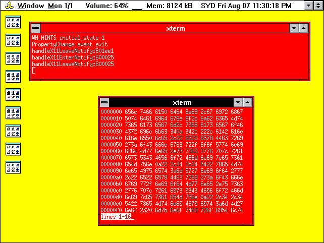
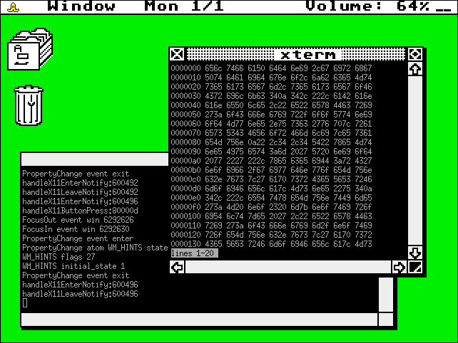
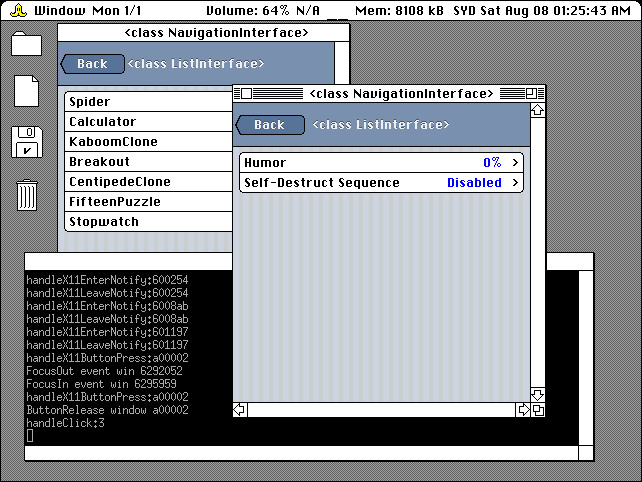
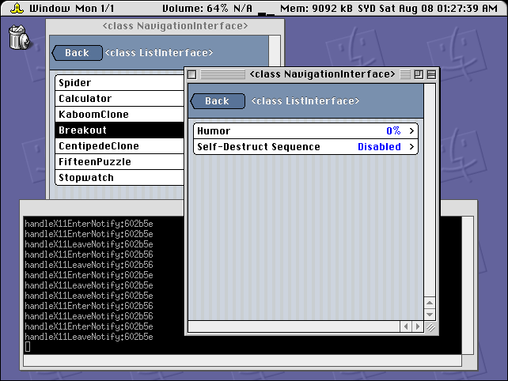

# HOT DOG Linux

For more information, please visit http://hotdoglinux.com

## Screenshots

## Overview

The design goals of HOT DOG Linux include:

  * Graphical user interface based on retro computer systems including Windows 3.1 Hot Dog Stand, Amiga Workbench, Atari ST GEM, and Classic Mac
  * Custom lightweight Objective-C foundation
  * Bitmapped graphics, low DPI displays
  * No Unicode support by design

HOT DOG Linux uses a custom lightweight Objective-C foundation on top of the GNUstep Objective-C runtime. It does not use the GNUstep Foundation. The style of Objective-C is completely different from the one Apple uses, everything is basically **id**.

By design, Unicode is not supported.

Low DPI displays are preferred, since the graphics are bitmapped and fixed in size. The preferred aspect ratio for HOT DOG Linux is 4:3. 

HOT DOG Linux does not use Automatic Reference Counting. It causes problems with type-checking during compilation (it is too strict).

HOT DOG Linux is an acryonym that stands for **H**orrible **O**bsolete **T**ypeface and **D**readful **O**nscreen **G**raphics for Linux.

## How to compile and run

$ sh makeExternal.sh

$ sh makeUtils.sh

$ perl build.pl

To run the window manager:

$ ./hotdog runWindowManager

To run the iPod style interface:

$ ./hotdog

## Dependencies

The following executables must be in your PATH or at location if specified:

  * inotifywait
  * xrandr
  * ifconfig (used by Utils/printNetworkInfo)
  * find (used by build.pl)
  * clang
  * /usr/bin/perl
  * /bin/bash (used by Utils/printDateEverySecondForTimezone:text:)
  * date (used by Utils/printDateEverySecondForTimezone:text:)

(this list is probably incomplete)

The following libraries must have headers available and be linkable:

  * libX11
  * libXext
  * libXfixes
  * libGL (Mesa should work)
  * libpthread
  * libm

These are optional:

  * xterm
  * mpv
  * mupdf (used by Config/fileHandlers.csv)
  * firefox (used by Config/rootWindowMenu.csv and Config/fileHandlers.csv)
  * thunderbird (used by Config/rootWindowMenu.csv)
  * x64 (used by Config/fileHandlers.csv)
  * mupen64plus (used by Config/fileHandlers.csv)

(this list is probably incomplete)

## Legal

Copyright (c) 2020 Arthur Choung. All rights reserved.

Email: arthur -at- hotdoglinux.com

Released under the GNU General Public License, version 3.

For details on the license, refer to the LICENSE file.

