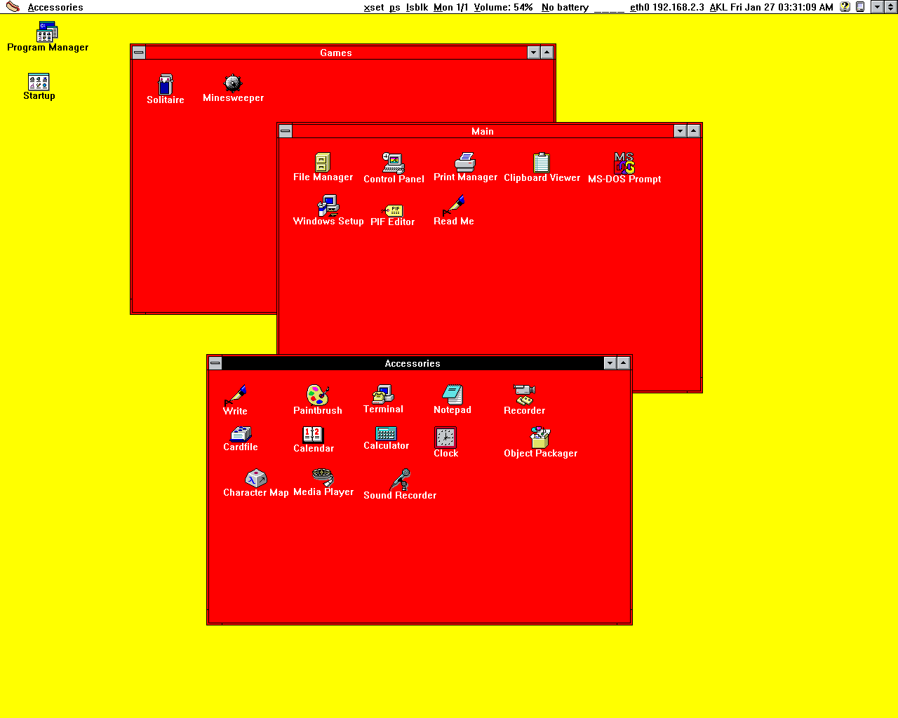
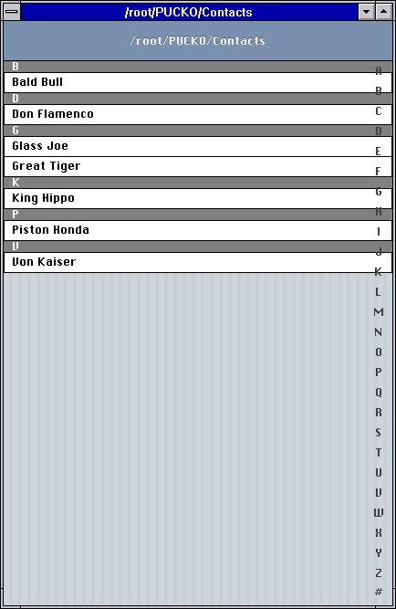
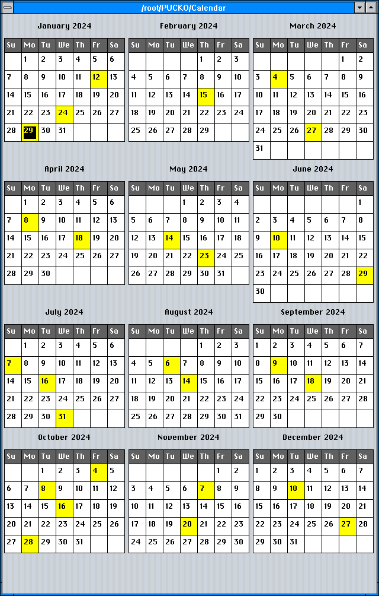
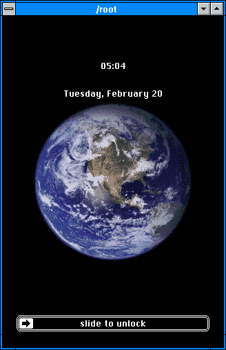

# HOTDOG

For more information, please visit http://hotdoglinux.com

## Note: FreeBSD is now the development platform. Linux is no longer supported.

## Download (deprecated)

Installer ISO based on Slackware64 (1.28 GB)

Minimal ISO based on Slackware64 that runs from RAM (192 MB)

Boot with Legacy BIOS.

If using VirtualBox, 3D acceleration should be enabled.

This is a multilib system, the only 32-bit application included is Wine.

It comes with the 64-bit gcc only, so the included gcc cannot create 32 bit binaries.

It is a stripped down system that does not include systemd, wayland, elogind, polkit, pulseaudio, or NetworkManager.

http://hotdoglinux.com/download/

## Hotdog on a (USB) stick (deprecated)

To write the image to a USB drive:

$ dd if=/path/to/file.iso of=/dev/sdX bs=1M

/path/to/file.iso is the file name of the image file.

/dev/sdX is the USB device to write the image to.

Run as root. Be careful not to write to the wrong drive.

## Overview

The design goals of HOTDOG include:

  * Graphical user interface based on retro computer systems including Hot Dog Stand (Windows 3.1), Amiga Workbench, Atari ST GEM, Mac Classic and Aqua
  * Custom lightweight Objective-C foundation
  * Bitmapped graphics, low DPI displays
  * No Unicode support by design

HOTDOG uses a custom lightweight Objective-C foundation on top of the GCC Objective-C runtime. The style of Objective-C is completely different from the one Apple uses, everything is basically **id**.

Alternatively, it is possible to use an older version of the GNUstep Objective-C runtime that uses the old object struct layout (located in external/libobjc2). This requires everything to be compiled with clang, and allows for the use of Objective-C 2.0 features such as NSFastEnumeration and NSArray/NSDictionary literals, as well as blocks and libdispatch (with the appropriate libs). However, the GCC runtime has better performance, so it is the default.

By design, Unicode is not supported.

Low DPI displays are preferred, since the graphics are bitmapped and fixed in size.

HOTDOG does not use Automatic Reference Counting. It causes problems with type-checking during compilation (it is too strict).

HOTDOG is an acronym that stands for **H**orrible **O**bsolete **T**ypeface and **D**readful **O**nscreen **G**raphics.

## How to compile and run

$ sh makeUtils.sh

$ perl build.pl

To run the window manager:

$ ./hotdog runWindowManager

To run the iPod style interface:

$ ./hotdog

## Notes

Aqua mode uses 'compton' for window drop shadows and 'feh' to set the wallpaper.

Some of the Perl scripts use the JSON module.

## Screenshots

WinMac 1280x1024

WinMac is a combination of the Windows 3.1 window borders and font, the classic Mac menu bar, and dialogs featuring CATS from Zero Wing (All your base are belong to us).


Hot Dog Stand 1280x1024



Atari ST GEM 1280x1024


Amiga Screenshot 1280x1024


Mac Classic 1280x1024


Mac Color 1280x1024


Mac Platinum 1280x1024


Aqua 1280x1024


## iOS 4/5/6

This is an attempt to recreate iOS 4/5/6 with simplified graphics that would be suitable for the 8-bit or 16-bit era.

### Home Screen

This is a preliminary version of the home screen with Windows 3 icons.


### Music

A music browser in the style of the old versions of iOS.

Displays a list based on the files in the current directory, using the output of the following scripts:

  * hotdog-music-listAlbumsForArtist:.py
  * hotdog-music-listArtists.py
  * hotdog-music-listSongsForArtist:.py
  * hotdog-music-listTracksForAlbum:.py

These scripts can be modified as desired.

Currently requires Python modules mutagen and pillow.

To show albums:

```
$ hotdog show AlbumListNavigation
```


Click on an album to list the tracks:


To show songs:

```
$ hotdog show SongListNavigation
```


To show artists:

```
$ hotdog show ArtistListNavigation
```


### Contacts

A vcf/vcard browser in the style of the old versions of iOS.

Displays a list based on the files in the current directory, using the output of the following scripts:

  * hotdog-contacts-list.py
  * hotdog-contacts-printFile:.py

These scripts can be modified as desired.

Currently requires Python modules vobject and pillow.

To show list:

```
$ hotdog show ContactListNavigation
```



Click on a row to show details:


### Calendar

Displays a calendar using the output of 'cal' for the actual calendar.

The script 'hotdog-calendar-listEvents.py' reads .ics files in the current directory and lists the event dates, which are highlighted in yellow.

These scripts can be modified as desired.

Currently requires Python module vobject.

To show a yearly calendar:

```
$ hotdog show CalendarInterface
```



### Lock Screen

```
$ hotdog show LockScreen
```



## Related

Hotdog Pucko

https://hotdogpucko.com

## Legal

Copyright (c) 2020 Arthur Choung. All rights reserved.

Email: arthur -at- hotdogpucko.com

Released under the GNU General Public License, version 3.

For details on the license, refer to the LICENSE file.

