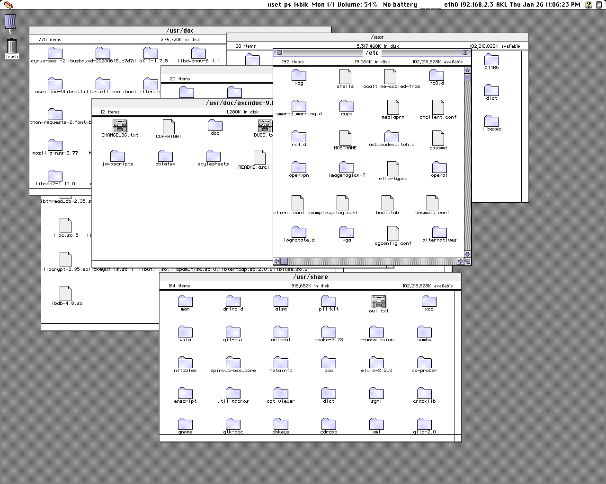

# HOT DOG Linux

For more information, please visit http://hotdoglinux.com

## Download

Installer ISO based on Slackware64 (1.52 GB)

Minimal ISO based on Slackware64 that runs from RAM (195 MB)

Boot with Legacy BIOS, untested on virtual machines

http://hotdoglinux.com/download/

## Hot Dog (Linux) on a (USB) stick

To write the image to a USB drive:

$ dd if=/path/to/file.iso of=/dev/sdX bs=1M

/path/to/file.iso is the file name of the image file.

/dev/sdX is the USB device to write the image to.

Run as root. Be careful not to write to the wrong drive.

## Overview

The design goals of HOT DOG Linux include:

  * Graphical user interface based on retro computer systems including Hot Dog Stand (Windows 3.1), Amiga Workbench, Atari ST GEM, Mac Classic and Aqua
  * Custom lightweight Objective-C foundation
  * Bitmapped graphics, low DPI displays
  * No Unicode support by design

HOT DOG Linux uses a custom lightweight Objective-C foundation on top of the GNUstep Objective-C runtime. It does not use the GNUstep Foundation. The style of Objective-C is completely different from the one Apple uses, everything is basically **id**.

By design, Unicode is not supported.

Low DPI displays are preferred, since the graphics are bitmapped and fixed in size. The preferred aspect ratio for HOT DOG Linux is 5:4 in landscape, and 3:4 in portrait. 

HOT DOG Linux does not use Automatic Reference Counting. It causes problems with type-checking during compilation (it is too strict).

HOT DOG Linux is an acronym that stands for **H**orrible **O**bsolete **T**ypeface and **D**readful **O**nscreen **G**raphics for Linux.

## How to compile and run

$ sh makeUtils.sh

$ perl build.pl

To run the window manager:

$ ./hotdog runWindowManager

To run the iPod style interface:

$ ./hotdog

## Notes

Aqua mode uses 'compton' for window drop shadows and 'feh' to set the wallpaper.

Some of the Perl scripts use the JSON module.

## Screenshots

Aqua 1280x1024

Amiga Screenshot 1280x1024

Hot Dog Stand 640x480

Atari ST GEM 640x480

Mac Classic 640x480

Mac Color 640x480

Mac Platinum 640x480

ALSA Mixer Panel

$ hotdog-openALSAPanel.sh hw:0

## HOTDOGbuntu -- Ubuntu compatibility

HOTDOG can be run on Ubuntu and its derivatives.

See the NOTES-Ubuntu file for more information.

## Legal

Copyright (c) 2020 Arthur Choung. All rights reserved.

Email: arthur -at- hotdoglinux.com

Released under the GNU General Public License, version 3.

For details on the license, refer to the LICENSE file.

