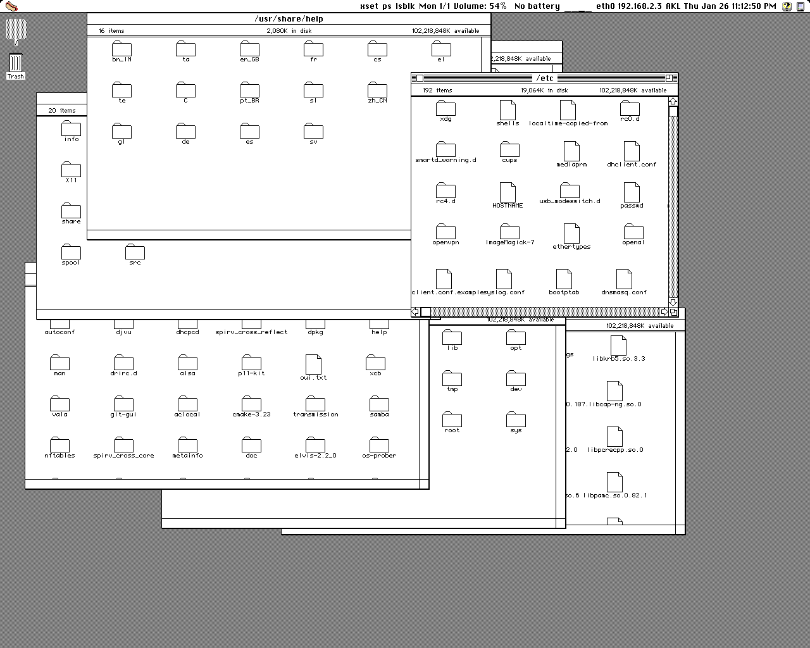

# HOT DOG Linux

For more information, please visit http://hotdoglinux.com

## Download

Installer ISO based on Slackware64 (1.28 GB)

Minimal ISO based on Slackware64 that runs from RAM (192 MB)

Boot with Legacy BIOS.

If using VirtualBox, 3D acceleration should be enabled.

This is a multilib system, the only 32-bit application included is Wine.

It comes with the 64-bit gcc only, so the included gcc cannot create 32 bit binaries.

It is a stripped down system that does not include systemd, wayland, elogind, polkit, pulseaudio, or NetworkManager.

http://hotdoglinux.com/download/

## Hot Dog (Linux) on a (USB) stick

To write the image to a USB drive:

$ dd if=/path/to/file.iso of=/dev/sdX bs=1M

/path/to/file.iso is the file name of the image file.

/dev/sdX is the USB device to write the image to.

Run as root. Be careful not to write to the wrong drive.

## Overview

The design goals of HOT DOG Linux include:

  * Graphical user interface based on retro computer systems including Hot Dog Stand (Windows 3.1), Amiga Workbench, Atari ST GEM, Mac Classic and Aqua
  * Custom lightweight Objective-C foundation
  * Bitmapped graphics, low DPI displays
  * No Unicode support by design

HOT DOG Linux uses a custom lightweight Objective-C foundation on top of the GNUstep Objective-C runtime. It does not use the GNUstep Foundation. The style of Objective-C is completely different from the one Apple uses, everything is basically **id**.

By design, Unicode is not supported.

Low DPI displays are preferred, since the graphics are bitmapped and fixed in size. The preferred aspect ratio for HOT DOG Linux is 5:4 in landscape, and 3:4 in portrait. 

HOT DOG Linux does not use Automatic Reference Counting. It causes problems with type-checking during compilation (it is too strict).

HOT DOG Linux is an acronym that stands for **H**orrible **O**bsolete **T**ypeface and **D**readful **O**nscreen **G**raphics for Linux.

## How to compile and run

$ sh makeUtils.sh

$ perl build.pl

To run the window manager:

$ ./hotdog runWindowManager

To run the iPod style interface:

$ ./hotdog

## Notes

Aqua mode uses 'compton' for window drop shadows and 'feh' to set the wallpaper.

Some of the Perl scripts use the JSON module.

## Screenshots

Mac Platinum 1280x1024

Mac Color 1280x1024

Mac Classic 1280x1024

Atari ST GEM 1280x1024

Amiga Screenshot 1280x1024

Aqua 1280x1024

Hot Dog Stand 640x480

## HOTDOGbuntu -- Ubuntu compatibility

HOTDOG can be run on Ubuntu and its derivatives.

See the NOTES-Ubuntu file for more information.

## Legal

Copyright (c) 2020 Arthur Choung. All rights reserved.

Email: arthur -at- hotdoglinux.com

Released under the GNU General Public License, version 3.

For details on the license, refer to the LICENSE file.

